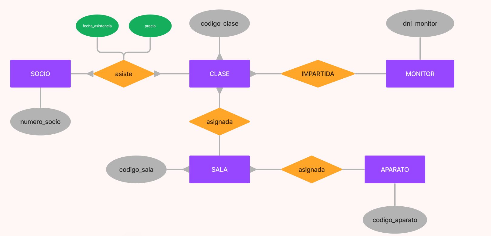

## Diagrama E-R. B.D. Gimnasio

1. **Identificar Entidades y Claves Primarias:**

   - Entidades:
     1. socio (PK: numero_socio)
     2. sala (PK: codigo_sala)
     3. aparato (PK: codigo_aparato)
     4. clase (PK: codigo_clase)
     5. monitor (PK: dni_monitor)

2. **Identificar Relaciones y Grado:**

   - Relaciones:
     1. socio --- asiste --- clase M:N
     2. aparato --- asignada --- sala 1:M
     3. monitor --- impartida --- clase 1:M
     4. clase --- realizada --- sala 1:M

3. **Diseño Conceptual:**

   

4. **Diseño Lógico:**

   1. **Tabla socio:**

      - numero_socio (PK)
      - dni
      - nombre
      - telefono
      - profesion
      - datos_bancarios

   2. **Tabla sala:**

      - codigo_sala (PK)
      - metros_cuadrados
      - ubicacion
      - tipo_sala

   3. **Tabla aparato:**

      - codigo_aparato (PK)
      - descripcion
      - estado_conservacion
      - codigo_sala (FK)

   4. **Tabla clase:**

      - codigo_clase (PK)
      - descripcion
      - fecha
      - codigo_sala (FK)
      - dni_monitor (FK)

   5. **Tabla monitor:**

      - dni_monitor (PK)
      - nombre
      - telefono
      - titulacion
      - experiencia_profesional
      - nivel_clase

   6. **Tabla asiste:**
      - numero_socio (FK)
      - codigo_clase (FK)
      - fecha_asistencia
      - precio
