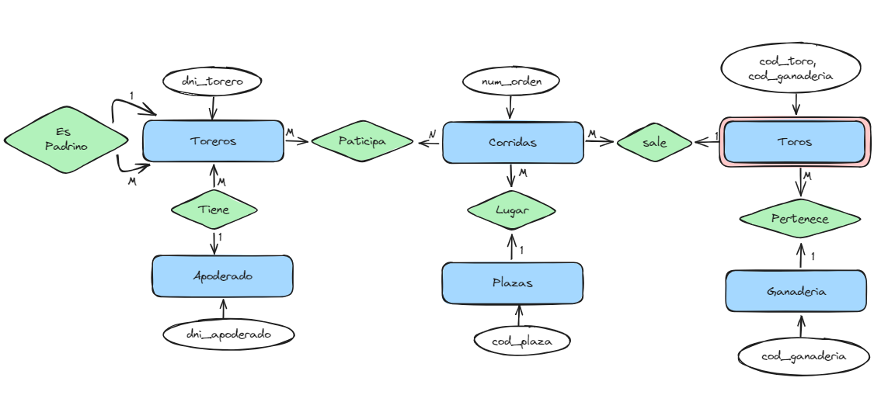

# **Ejercicio Toros**

### Para el siguiente ejercicio se pide construir el modelo conceptual (diagrama E-R) y pasarlo posteriormente al modelo lógico (tablas, paso 5º), desarrollando e identificando todos los pasos.

1. Se desea recoger en una base de datos información acerca de las corridas de toros que se celebran en España y de todos los datos relacionados con ellas.

**Se consideran los siguientes supuestos:**

- Cada corrida se identificada conjuntamente por un número de orden, la feria en la que se celebra y el año de celebración (por ejemplo: número = 2, feria = San Isidro, año = 1990).

- En una determinada corrida actúan una serie de toreros de los que se desea guardar su DNI, nombre, apodo y fecha en que tomó la alternativa (fecha en la que  se convirtió en matador de toros). Además se desea saber quién fue el padrino, torero que le dio la alternativa en su día (un torero puede dar la alternativa a varios toreros o a ninguno).

- Cada torero puede tener un apoderado del que es protegido. A su vez, un apoderado lo puede ser de varios toreros. De él se desea saber su DNI, nombre, dirección y teléfono.

- Una corrida se celebra en una plaza de toros de la que se desea saber su nombre que se supone único, localidad, dirección y aforo. En una misma plaza se pueden celebrar varias corridas de toros.

- En cada corrida son estoqueados al menos 6 toros. Cada toro viene identificado conjuntamente por el código de la ganadería a la que pertenece y un código del toro. Además, se desea mantener información acerca de su nombre, fecha de nacimiento, color y el orden en que fue toreado.

- Cada toro pertenece a una ganadería determinada. De cada ganadería se pretende saber su código, nombre, localidad y antigüedad (fecha de creación).

- Cada torero que actúa en una corrida obtiene una serie de premios (cuántas orejas, cuántos rabos y si salió por la puerta grande o no) de los que se desea mantener información.

Indica cuál es la entidad débil y la relación reflexiva, explica tu respuesta.

**PASOS:**

- **1. Identificar las Entidades**
    - Corridas 
    - Toreros
    - Apoderado
    - Plazas
    - Toros
    - Ganaderia
- **2. Identificar las claves de las Entidades**
    - Corridas (num_orden)
    - Toreros (dni_torero)
    - Apoderado (dni_apoderado)
    - Plazas (cod_plaza)
    - Toros (cod_toro, cod_ganaderia)
    - Ganaderia (cod_ganaderia)
- **3. Identificar las relaciones y grado. El nombre de la relación es la que está entre paréntesis, el grado puede ser de 1:1 o de 1:M o de M:N**
    - Toreros (dni_torero) <\1>======<\M> Toreros (dni_torero) 
    - Toreros (dni_torero) <\M>======<\1> Apoderado (dni_apoderado)
    - Toros (cod_toro) <\M>======<\1> Ganaderia (cod_ganaderia)
    - Toreros (cod_torero) <\M>======<\N> Corridas (num_orden)
    - Corridas (num_orden) <\M>======<\1> Toros (cod_toro)
- **4. Diseño Conceptual. Diagrama Entidad-Relación (Modificar el siguiente dibujo para hacer el diagrama entidad-relación)**
    
- **5. Diseño Lógico. Tablas**
    - Corridas (*num_orden*, feria, año_celebracion, cod_participiacion, cod_toro)
    - Toreros (*dni_torero*, nombre, apodo, fecha, **cod_padrino**, **cod_apoderado**)
    - Apoderado (*dni_apoderado*, nombre, direccion, telefono)
    - Plazas (*cod_plaza*, nombre, localidad, direccion, aforo)
    - Toros (*cod_toro*, ***cod_ganaderia***, nombre, fecha_nacimiento, color, orden_toreado)
    - Ganaderia (*cod_ganaderia*, nombre, locacalidad, antigüedad)

***Indica cuál es la entidad débil y la relación reflexiva, explica tu respuesta:*** La débil es la entidad Toros en la relación con ganaderia, porque depende entre ellas. 